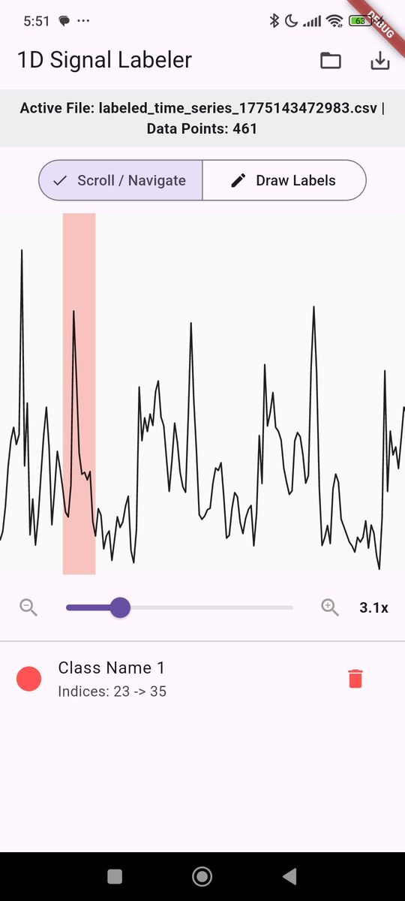

# 1D Signal Labeling App

A multi-platform Flutter application designed to load, visualize, and label 1D sequential data to generate ground-truth segmentation masks for training 1D Convolutional Neural Networks (CNNs).

## Screenshot


## Features

* **Interactive Signal Visualization:** Renders 1D signals efficiently using a highly optimized `CustomPainter` capable of rendering standard sample windows (500-1000+ data points) at 60fps.
* **Dynamic Zoom:** Seamlessly scale the X-axis up to 10x magnification to closely inspect high-frequency data and tightly clustered peaks.
* **Mode Toggle (Pan vs. Draw):** A dedicated switch to separate scrolling from labeling, ensuring zero gesture conflicts and a buttery-smooth experience on touch-screens and mobile devices.
* **Touch-and-Drag Annotation:** Intuitive click-and-drag interface to highlight specific waveform regions.
* **Dynamic Class Management:** Easily assign predefined classes to highlighted regions and delete mistakes on the fly.
* **Cross-Platform Export:** Generates and exports a 1D segmentation mask array alongside the raw data to a new CSV file. Fully compatible with Desktop file systems and mobile sandboxed storage (Android Scoped Storage / iOS Files).

## Output Format

The app exports a mapped CSV file ready for ML training pipelines. The exported CSV contains three columns:
* `Index`: The array index.
* `RawValue`: The original signal value.
* `ClassId`: The integer ID of the assigned label (`0` defaults to background/unlabeled).

## Tech Stack

* **Framework:** Flutter
* **State Management:** `flutter_bloc` (Cubit)
* **File I/O:** `file_picker` (Cross-platform save/load dialogues)
* **Data Parsing:** `csv` (v8+ streaming API for robust, memory-efficient parsing)

## Architecture

The project utilizes a feature-first, domain-driven architecture to strictly separate the UI from the underlying state and file I/O operations.

```text
lib/
├── core/
│   ├── constants.dart           # Centralized configuration for label classes and colors
├── models/
│   ├── signal_data.dart         # Immutable data class for the 1D array
│   └── signal_region.dart       # Model for user-defined annotation windows
├── services/
│   ├── file_picker_service.dart # Wraps the file_picker package logic
│   ├── csv_parser_service.dart  # Handles file reading and v8 stream decoding
│   └── export_service.dart      # Generates masks and handles platform-specific file writing
├── features/
│   └── labeling/
│       ├── screens/
│       │   └── labeling_workspace.dart # Main UI scaffold
│       ├── widgets/
│       │   ├── interactive_chart.dart  # GestureDetector wrapper for panning logic
│       │   ├── signal_painter.dart     # Canvas rendering for signal path and region highlights
│       │   └── class_selector.dart     # Dialog UI for assigning classes to regions
│       └── state/
│           └── labeling_cubit.dart     # Business logic and state coordination
│           └── labeling_state.dart     # Immutable state class for the labeling feature
└── main.dart
```

## Getting Started

### Prerequisites
* Flutter SDK (latest stable)
* Target platform toolchains (Android Studio, Xcode, or Desktop build tools)

### Installation
1. Clone the repository:
    ```bash
    git clone httops://github.com/IoT-gamer/flutter_1d_signal_labeling_app.git
    cd flutter_1d_signal_labeling_app
    ```
2. Install dependencies:
    ```bash
    flutter pub get
    ```
3. Run the app:
    ```bash
    flutter run
    ```
### Mobile Deployment
* For Android, ensure you have an emulator or physical device connected.
* For iOS, open the project in Xcode and configure signing before running on a simulator or physical device.
### Desktop Deployment
* For Linux Desktop, ensure you have the necessary [build tools](https://docs.flutter.dev/platform-integration/linux/setup#:~:text=Configure%20your%20development%20environment%20to,$%20flutter%20doctor%20%2Dv%20content_copy) installed and run `flutter run -d linux`.
    * **note:** you might have to instsll **lld**: `sudo apt-get install lld`

## Configuration
### Customizing Label Classes
To adapt the app for a different 1D CNN task, you can modify the available classes in `lib/core/constants.dart`.
```dart
// Example configuration
const List<LabelClass> availableClasses = [
  LabelClass("Class Name 1", 1, Colors.redAccent),
  LabelClass("Class Name 2", 2, Colors.blueAccent),
  LabelClass("Class Name 3", 3, Colors.green),
  LabelClass("Class Name 4", 4, Colors.orange),
];
```
Adding a new class here will automatically populate it in the UI selection dialog, map it to the `CustomPainter` highlights, and bind its ClassId to the exported CSV mask.

## Usage
1. **Load Data:** Click **Select CSV File** or the **Folder** icon in the AppBar and select a CSV containing a 1D signal. (⚠️ *Note: The parser expects the signal data to be located in the second column, skipping the first row as a header*).

2. **Navigate:** Ensure the mode toggle is set to **Scroll / Navigate**. Use the zoom slider to scale the chart and pan to your region of interest.

3. **Annotate:** Switch the mode toggle to **Draw Labels**. Click and drag horizontally across the chart to select a region.

4. **Classify:** Select the appropriate class from the popup dialog.

5. **Review & Edit:** Check your committed regions in the list below the chart. Use the **Trash** icon to delete any mistakes.

6. **Export:** Click the **Save** icon in the AppBar to export the generated segmentation mask to your local device.

## LICENSE
This project is licensed under the MIT License - see the [LICENSE](LICENSE) file for details.